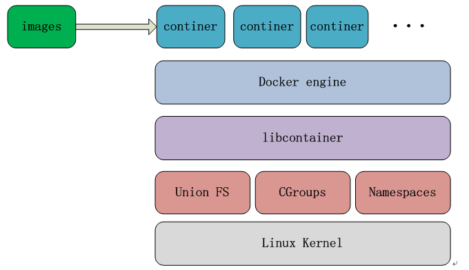

# docker

## 1 基础知识

### 1.1 dockerfile

#### 1.1.1 RUN, CMD & ENTRYPOINT

RUN是在building image时会运行的指令, 在Dockerfile中可以写多条RUN指令   

CMD和ENTRYPOINT则是在运行container 时会运行的指令, 都只能写一条, 如果写了多条, 则最后一条生效.   
   
CMD在运行时会被docker run时的command覆盖。如“docker run postgres:9.3.5 psql”，这里的psql就是command, 将覆盖Dockerfile的CMD, 但是不会覆盖ENTRYPOINT.   

ENTRYPOINT不会被运行时的command覆盖, 但是也可以在docker run运行时输入--entrypoint覆盖.   

CMD和ENTRYPOINT一般用于制作具备后台服务的image, 例如apache, database等. 在使用这种image启动container时, 自动启动服务.关于二者的详细区别可参考[Dockerfile中的CMD与ENTRYPOINT](https://www.cnblogs.com/sparkdev/p/8461576.html).

ENTRYPOINT格式如下:   
ENTRYPOINT ["executable", "param1", "param2"]   // 这是 exec 模式的写法，注意需要使用双引号。   
ENTRYPOINT command param1 param2                // 这是 shell 模式的写法。

VOLUME是指定对外暴露的文件，可以在docker run的时候使用-v参数把外面的文件/文件夹映射过来。

一个dockfile内容如下

FROM centos:msec   
MAINTAINER AlexStocks   
ADD /test/docker/msec/msec_console/rc.local /etc/rc.d/   
ADD ./rc.local /etc/rc.d/ # 注意此处要用相对路径   
VOLUME /msec   
USER root   
WORKDIR /root/   
CMD bash /etc/rc.d/rc.local   

Dockerfile 中每一个指令都会创建一个镜像层，上层是依赖于下层的。无论什么时候，只要某一层发生变化，其上面所有层的缓存都会失效。每个镜像曾的内容都可以通过sudo docker images -a看到。

#### 1.1.2 构建镜像

docker build -t alexstocks-repo/scylladb-server .

docker build . --compress --no-cache -t alexstocks-repo/scylladb-server -f ./Dockerfile

### 1.2 容器文件组织

#### 1.2.1 log

找到对应container的日志文件，一般是在 /var/lib/docker/containers/containerid/containerid.log-json.log（containerid是指你的容器id）

### 1.3 docker-compose

安装命令：sudo curl -L "https://github.com/docker/compose/releases/download/1.17.1/docker-compose-$(uname -s)-$(uname -m)" -o /usr/bin/docker-compose

#### 1.3.1 相关参数

ref: [Docker Compose 配置文件详解](http://www.jianshu.com/p/2217cfed29d7)

environment  设置镜像变量，它可以保存变量到镜像里面，启动的容器也会包含这些变量设置，类似于Dockerfile 中的 ENV和docker run -e 的效果
networks 加入指定网络

#### 1.3.2 docker-compose.yml

version: "3"   

services:   
    console:   
        build: ./msec_console   
        restart: always   
        dns:   
            - 8.8.8.8   
            - 9.9.9.9   
            - 114.114.114.114   
        networks:   
            web:   
                ipv4_address: 10.10.10.2   
        environment:   
            - DC1=DC1   
   
networks:   
  web:   
    driver: bridge   
    ipam:   
     config:   
       - subnet: 10.10.10.0/16   

启动命令：sudo docker-compose up -d

## 2 查询/下载/上传/删除镜像以及tag
docker images   
docker search scylla   
docker pull scylladb/scylla:2.0.0   
   
docker tag scylla:latest scylladb/scylla:2.0.0 # 为镜像打tag   
docker push registry.ikurento.com/scylla       # 上传到仓库中心   
docker search registry.ikurento.com/scylla # 查看仓库中镜像   
   
docker commit 1d2a55 centos::with_mysql # 根据某个容器制作一个镜像，centos是repository，with_mysql是tag   
docker export 5a -o ./a.tar # 把某个容器导出为一个tar文件   
docker import a.tar as/test:v1.0 # 导入某个镜像   
   
docker rmi -f 4ceb78c18723 # 删除镜像   
   
docker tag 4c alexstocks-repo/test # 为镜像id命名tag   
docker tag scylla:latest scylla:2.0.0 # 重命名tag   

## 3 启停删容器
docker run --net=host -it -d --privileged=true --name scylla alexstocks-repo/scylladb-server

docker run --net=host -d -it--privileged=true -v /etc/localtime:/etc/localtime:ro  ec8573d84210 '/etc/rc.d/rc.local' # ro = readonly, ec是镜像id，最后是启动脚本

docker run --name u5 -it --rm docker.io/ubuntu # 容器启动就进去，—rm指示退出的时候容器会被删除   
docker stop -f 83fd   
docker start scylla   
docker stop scylla   
docker rm 83fd     # 强制删除可以加参数-f

docker pause 83fd # suspend a container   
docker unpause 83fd   
docker stats 83fd # 类似于top命令，查看docker进程在host机器上cpu、mem等使用情况   

大约在0.6版，privileged被引入docker。   
使用该参数，container内的root拥有真正的root权限。
否则，container内的root只是外部的一个普通用户权限。
privileged启动的容器，可以看到很多host上的设备，并且可以执行mount。
甚至允许你在docker容器中启动docker容器。

## 4 查看、进入当前docker进程
docker ps -a   
docker logs 0802 # 输出容器运行过程中产生的日志，一般用于观察容器的启动历史   

docker inspect 0802   
docker inspect -f {{.State.Pid}} 0802   
docker inspect --format='{{.NetworkSettings.IPAddress}}' 5a   
docker inspect --format={{.NetworkSettings.IPAddress}} 5a   
docker inspect -f '{{.NetworkSettings.IPAddress}}' 5a   
docker inspect -f {{.NetworkSettings.IPAddress}} 5a   

docker exec -it 0802 /bin/bash    # 退出的时候执行exit即可，-i意思是interactive，由于没有分配伪终端，看起来像pipe执行一样，但是执行结果、命令返回值都可以正确获取。-t则是terminal，显示console界面，如果只用-t则无法输入命令   
docker exec -d bb2 /a.sh  # 如果一个命令需要长时间进程，使用-d参数会很快返回。 程序在后台运行。   

nsenter --target 27166  --uts --ipc --net --pid   

docker attach 5a # attach到容器5a的stdio，退出的时候如果执行exit，会导致容器的停止。最好在终端里按CTRL-p CTRL-q

## 5 数据卷

数据卷类似于vagrant中的磁盘目录映射。将母机上的一个目录挂载到容器的某个目录上，那么在容器里发生的所有修改，都体现在母机的磁盘(目录)里了。这样就将静态的镜像文件和动态的用户数据分离开来了，好处显而易见。   

通过-v创建数据卷只设置了容器的挂载点，并没有指定关联的主机目录，跟dockerfile中的VOLUME作用一样，docker会自动绑定主机上的一个目录，通过docker inspect 命令可以查看到   
docker run -v /data1 -it -d --name scylla alexstocks-repo/scylladb-server 
 
将主机的/data/dir挂载到容器中   
docker run -v /data/dir:/data1 -it -d --name scylla alexstocks-repo/scylladb-server 

如果想多个容器共享同一个数据卷，则使用—volumes-from docker-container-name   
docker run -d -it --volumes-from scylla --name u3 docker.io/ubuntu
一些专门用来提供数据卷供其他容器挂载的容器称为数据卷容器，如上面的scylla

挂载数据卷的容器被删除的时候需要添加-v   
dovker rm -v 0802

## 6 网络

宿主机与容器之间进行随机端口映射   
docker run -d -P 

宿主机与容器之间通过指定的端口映射   
docker run -d -p 2000:10527   
docker run -d -p 127.0.0.1:2000:10527   

容器互联，通过—link实现端口随机映射，格式为name:alias，name是要链接的容器名称，alias是链接别名   
docker run -d --name u1 doker.io/ubuntu   
docker run -d --name u2 --link u1:u1lu2  doker.io/ubuntu   

docker run时候也可以指定容器的网络方案

host方式   
指定方法：--net="host"   
这种创建出来的容器，可以看到host上所有的网络设备。   
容器中，对这些设备（比如DUBS）有全部的访问权限。因此docker提示我们，这种方式是不安全的。   
如果在隔离良好的环境中（比如租户的虚拟机中）使用这种方式，问题不大。   

bridge方案   
这种方案是默认设置，容器内会创建eth0，可以看到宿主机（可以通过ping测试）。   

none方式   
指定方法： --net="none"   
这样创建出来的容器完全没有网络。   
那这种方式，有什么用途呢？   
实际上openstack的nova-docker用的就是这种方式，这种方式将网络创建的责任完全交给用户。   
可以实现更加灵活复杂的网络。   
另外这种容器可以可以通过link容器实现通信。   

container复用方式   
指定方法： --net="container:name or id"   
这个方式可以让两个容器的网络完全相同。   

## 7 centos docker 安装

### 7.1 动手安装

https://mirrors.tuna.tsinghua.edu.cn/docker-ce/linux/centos/docker-ce.repo 里面的download.docker.com改为https://mirrors.ustc.edu.cn/docker-ce/  或者 https://mirrors.tuna.tsinghua.edu.cn/docker-ce 然后放入 /etc/yum.repos.d/ 下面；

sudo yum install -y docker-ce

### 7.2 使用官方脚本安装

wget -qO- https://get.docker.com/ | sh

## 8 原理

从Docker依赖的底层技术来看，Docker原生态是不能直接在Windows平台上运行的，只支持linux系统，原因是Docker依赖linux kernel三项最基本的技术,namespaces充当隔离的第一级，是对Docker容器进行隔离，让容器拥有独立的hostname,ip,pid，同时确保一个容器中运行一个进程而且不能看到或影响容器外的其它进程;Cgroups是容器对使用的宿主机资源进行核算并限制的关键功能。

比如CPU,内存,磁盘等，union FS主要是对镜像也就是image这一块作支持，采用copy-on-write技术，让大家可以共用某一层，对于某些差异层的话就可以在差异的内存存储，Libcontainer是一个库，是对上面这三项技术做一个封装。
Docker engine 用来控制容器container的运行，以及镜像文件的拉取。

### 8.1 swarm

Swarm的框架分成三块，第一块是Engine，第二是Manager，第三是KV store。它有几个特点，第一依赖外部存储来完成节点发现并保证一致性；第二，Manager只跟Daemon通信，不跟Agent通信；第三，Manager可以有多副本,这是为高可用设计的，采用一主多热备模式，所有manager都同时连接所有Daemon，备转发请求至主，另外，它依赖外部KV选主。

## 9 使用

### 9.1 部署

但是不建议一台机器上面部署太多的应用，同时部署的时候一定要差异化部署，什么意思呢，就是将大量计算的，和内存需要大的，IO操作频繁的对系统资源需求不一致的部署到同一台宿主机上。

### 9.2 微信对docker的使用

ref: [微信月活9亿的高效运维之路](http://www.sohu.com/a/212137383_463994)

* 接入层 独占物理机、 容量充足、 变更少
* 逻辑层 混合部署、 容量不可控、变更频繁
* 存储层 独占物理机、容量可控、变更少

哪一块上云，刚才也说到，接入层因为要扛住比较猛的量，微信的用户也比较多，如果它有什么问题，可能接入层会雪崩。所以我们主要是独占物理机，容量足，变更也少，暂时没有上云的需求。

在逻辑层这里，之前提到5000多个微服务，所以比较混乱，变更比较多，容量也不可控，所以这块上了云。

存储层这里，也没有上云，但是有单独的容量管理和数据迁移。